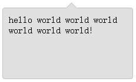

# 形状

> 对应的scss文件 `shape.scss`

生成一些常用形状样式，例如三角形

## 三角形

```scss
@include tringle($direction, $size, $color);
```
##### 参数

| 参数 | 说明 | 值 |
| --- | --- | 
| $direction | 方向 | top/right/bottom/left |
| $size | 大小 | 20px |
| $color | 颜色 | #333 |

##### 用法
```scss
@include absoluteCenter(top, 20px, #333);
```

## 带边框三角形

主要是用来漂浮框的指示方向三角形，例如

```scss
@mixin borderTriangle($direction, $size, $color, $borderSize, $borderColor, $overColor: transparent);
```

##### 参数
| 参数 | 说明 | 值 |
| --- | --- | 
| $direction | 方向 | top/right/bottom/left |
| $size | 大小 | 20px |
| $color | 颜色 | #333 |
| $borderSize | 边框大小 | 1px |
| $borderColor | 边框颜色 | red |
| $overColor | 底部溢出的颜色 | 可选，默认是transparent |

> overColor 在制作floating元素时指示方向可以使用与主内容背景颜色相同

##### 用法
```scss
.float-content {
  position: relative;
  width: 200px;
  height: 100px;
  border: 1px solid #c2c2c2;
  background-color: #e0e0e0;
  border-radius: 4px;
  padding: 10px;
  .arrow {
    @include borderTriangle(top, 18px, #e0e0e0, 1px, #c2c2c2, #e0e0e0);
    left: 50%;
    top: -7px;
    position: absolute;
  }
}
```
##### 效果



